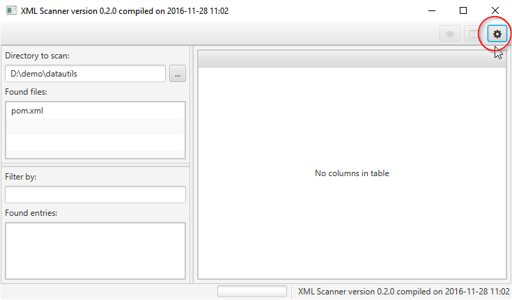
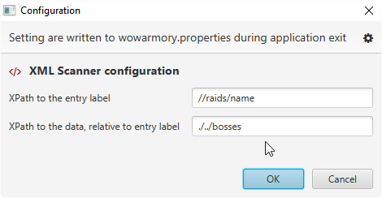
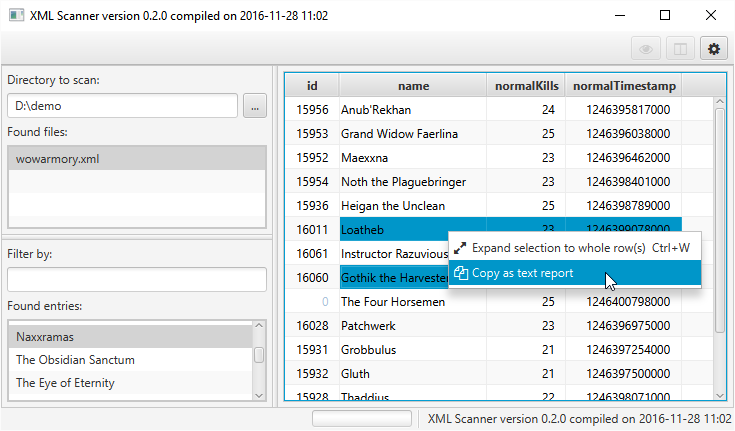

# datautils
Quick Kotlin project to analyze and present XML files

## Features (and limitations)
- [x] No schema needed, just two xpaths
- [ ] Can only read \*.xml files
- [x] Remembers settings (xpaths and directory)
- [x] Dynamically creates tables for subelements
- [ ] Cannot read attributes yet
- [x] Has limited command line launcher

## Prerequisities
For run, the only requirement is Java 8 JRE, update at least 40 (but why not latest?)

For clone and build, you'll need JDK, Maven and git. 

## Setup
Clone to your pc and build:
```shell
> git clone https://github.com/jakubgwozdz/datautils.git -b v0.3.0
> cd datautils
> mvn clean package
```

## First run
Just run the build with additional `--config=<filename>` parameter. That file will be created (on application exit) 
and will contain preferences for next runs. I'll use examples for World Of Warcraft armory format (xmlized https://eu.api.battle.net/wow/character/shadowsong/Kwinto?fields=progression)
```shell
> java -jar target/xmlscan-jar-with-dependencies.jar --config=wowarmory.properties
```

Now you need to configure xpaths to search for in selected xml files (top right corner, gear icon):



Assuming your xmls looks like that (`<raids>` are distinct entries and each `<bosses>` is one row) :
```xml
...
				<name>Yogg-Saron</name>
				<normalKills>11</normalKills>
				<normalTimestamp>1251842391000</normalTimestamp>
			</bosses>
			<bosses>
				<id>32871</id>
				<name>Algalon the Observer</name>
				<normalKills>0</normalKills>
				<normalTimestamp>0</normalTimestamp>
			</bosses>
		</raids>
		<raids>
			<name>Onyxia's Lair</name>
			<lfr>0</lfr>
			<normal>2</normal>
			<heroic>0</heroic>
			<mythic>0</mythic>
			<id>2159</id>
			<bosses>
				<id>10184</id>
				<name>Onyxia</name>
				<normalKills>4</normalKills>
				<normalTimestamp>1262381478000</normalTimestamp>
			</bosses>
		</raids>
		<raids>
			<name>Trial of the Crusader</name>
			<lfr>0</lfr>
			<normal>2</normal>
			<heroic>2</heroic>
			<mythic>0</mythic>
			<id>4722</id>
			<bosses>
				<id>0</id>
				<name>Northrend Beasts</name>
				<normalKills>13</normalKills>
				<normalTimestamp>1346266791000</normalTimestamp>
				<heroicKills>7</heroicKills>
				<heroicTimestamp>1259013698000</heroicTimestamp>
			</bosses>
			<bosses>
				<id>34780</id>
				<name>Lord Jaraxxus</name>
				<normalKills>10</normalKills>
				<normalTimestamp>1346266791000</normalTimestamp>
				<heroicKills>7</heroicKills>
				<heroicTimestamp>1259014137000</heroicTimestamp>
			</bosses>
			<bosses>
				<id>0</id>
				<name>Faction Champions</name>
				<normalKills>8</normalKills>
...
```

- XPath to the entry label: `//raids/name`
- XPath to the data, relative to label: `./../bosses`



That will search for all the raids and display killed bosses :)

Columns are generated dynamically and these that have all values the same, are hidden.

Now you can select some cells and on context menu you'll be able to `Copy as a text report`. 
All rows will be included in this report, but only the columns that have at least one cell selected.



After copy in clipboard you'll have the formatted report:
```
[         name         , normalKills, normalTimestamp]
[----------------------, -----------, ---------------]
[Anub'Rekhan           ,          24,   1246395817000]
[Grand Widow Faerlina  ,          25,   1246396038000]
[Maexxna               ,          23,   1246396462000]
[Noth the Plaguebringer,          23,   1246398401000]
[Heigan the Unclean    ,          25,   1246398789000]
[Loatheb               ,          23,   1246399078000]
[Instructor Razuvious  ,          23,   1246399546000]
[Gothik the Harvester  ,          25,   1246400196000]
[The Four Horsemen     ,          25,   1246400798000]
[Patchwerk             ,          23,   1246396975000]
[Grobbulus             ,          21,   1246397254000]
[Gluth                 ,          21,   1246397500000]
[Thaddius              ,          22,   1246398071000]
[Sapphiron             ,          23,   1246401073000]
[Kel'Thuzad            ,          20,   1246401558000]
```

## Command-line usage

With `-c` parameter, you can omit the graphical interface and just run the report generation
from command line.

```cmd
> java -jar target\xmlscan-jar-with-dependencies.jar -c \ 
        --config=wowarmory.properties \ 
        --inputFile=kwinto_shadowsong_eu.xml \
        --entry=Naxxramas \ 
        --columns=normalKills,name
```

When used with `-c`, the `--inputFile=<file.xml>` parameter is required, the rest is optional:
* `--config=<config.properties>` specifies alternate config file (default: `xmlscan.properties`)
* `--entry=<comma separated entries>` specifies entry(entries) to analyze and report (default: first entry in the file)
* `--columns=<comma separated column names>` columns to display (default: all)

